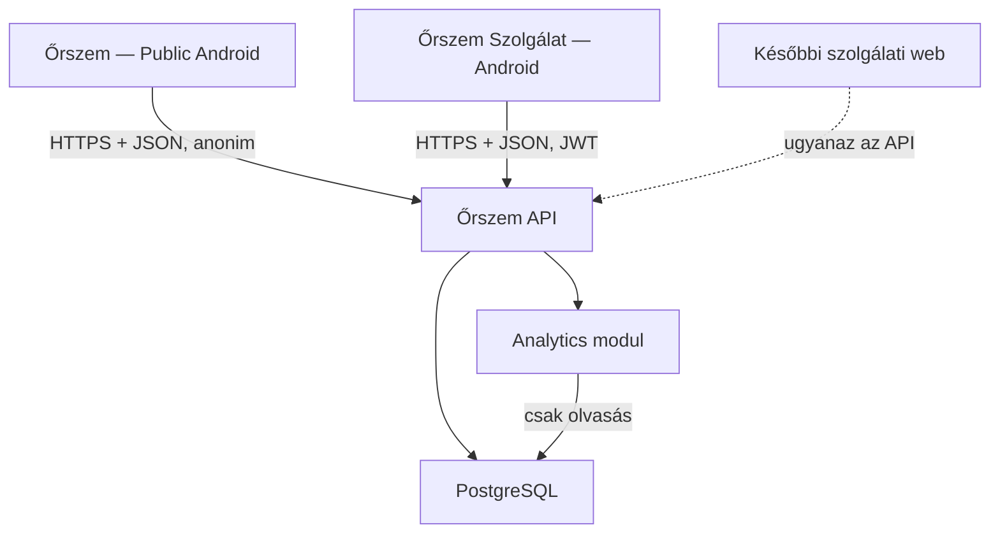
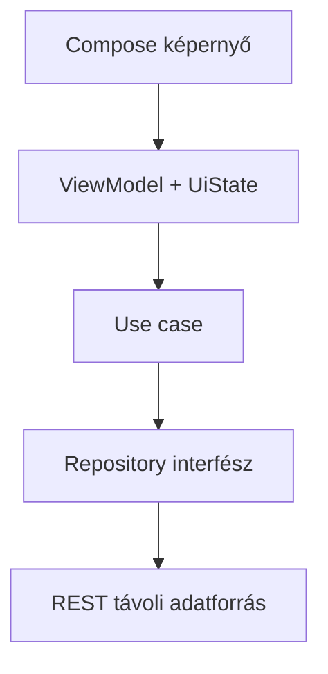
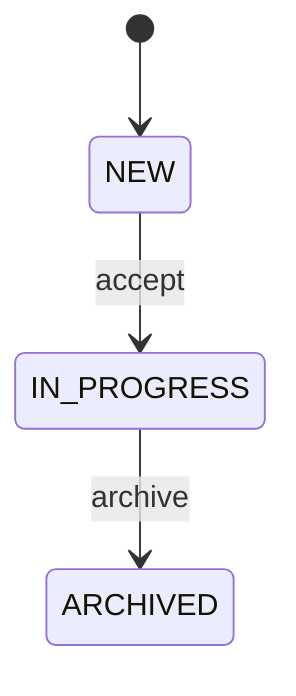
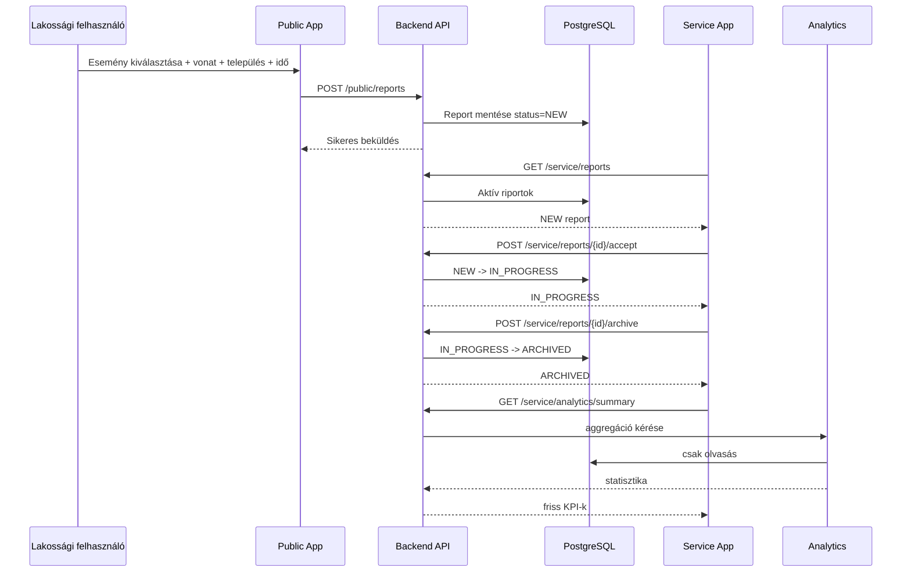

# Őrszem — Demo v1 technikai architektúra

**Dokumentum verzió:** `1.2`

**Dokumentum státusza:** Demo v1 architektúra — v1.1  
**Célközönség:** fejlesztő és implementáló AI (Claude Code)  
**Dátum:** 2026-09-01  
**Architekturális elv:** a Demo v1 legyen kicsi, stabil és gyorsan bemutatható, de minden lényeges határfelület úgy készüljön, hogy a Production verzió felé továbbfejleszthető legyen újraírás nélkül.

---

## 1. A dokumentum határa

Ez a specifikáció az Őrszem Demo v1 technikai alapját rögzíti:

- repository-struktúra;
- a két Android alkalmazás technológiája és rétegei;
- backend és adatbázis;
- API-szerződés;
- szolgálati esetkezelési workflow;
- statisztikai/elemző modul;
- komponensek felelősségi határai;
- biztonsági, tesztelési és üzemeltetési minimumok;
- a későbbi Production verzió bővítési pontjai.

A dokumentum nem helyettesíti a Demo v1 funkcionális és képernyőspecifikációját. Az implementáló AI nem találhat ki és nem építhet meg olyan termékfunkciót, amely nincs egyértelműen Demo v1 scope-ba sorolva.

### 1.1 Rögzített Demo v1 termékdöntések

1. Két külön Android alkalmazás készül:
   - **Őrszem** — anonim lakossági bejelentő alkalmazás;
   - **Őrszem Szolgálat** — bejelentkezéshez kötött szolgálati alkalmazás.
2. A lakossági alkalmazásban nincs regisztráció, felhasználói fiók vagy bejelentkezés.
3. A Demo v1-ben a bejelentő előre meghatározott, széles körű eseménylistából választ.
4. A Demo v1 jelentése nem tartalmaz szabad szöveges eseményleírást.
5. A jelentés kötelező üzleti adatai:
   - esemény típusa;
   - esemény időpontja;
   - vonat/járat azonosítója;
   - település.
6. A település manuálisan megadható; a GPS csak kényelmi funkció a település meghatározásához.
7. A szolgálati workflow állapotai:
   - `NEW`;
   - `IN_PROGRESS`;
   - `ARCHIVED`.
8. A szolgálati felhasználó új esetet elfogadhat, majd lezárhat és archiválhat.
9. Az Archívum a Demo v1 része.
10. A Statisztika a Demo v1 kötelező része.
11. A Demo v1-ben nincs generatív AI vagy LLM. A rendszer determinisztikus statisztikai/elemző modult használ.
12. A demo adatbázis seed adatokkal feltölthető és fejlesztői/demo környezetben visszaállítható.
13. A Demo v1-ben nincs Fő Admin, Moderátor, területi jogosultságkezelés, jelszó-reset és teljes user-management.
14. A backend és az adatmodell viszont úgy készül, hogy ezek később kontrollált migrációkkal hozzáadhatók legyenek.

### 1.2 Production verzióra rögzített, de Demo v1-ben nem implementálandó döntések

A következők későbbi Production követelmények:

- `SUPER_ADMIN`, `MODERATOR`, `SERVICE_USER` szerepkörök;
- egyetlen Fő Admin kiemelt jogosultsággal;
- egyedi szolgálati azonosító és jelszó minden szolgálati felhasználónak;
- szolgálati felhasználók területhez rendelése;
- szolgálati felhasználó csak a saját területéhez tartozó bejelentéseket láthatja;
- Fő Admin felhasználói azonosítókat szerkeszthet, jelszót resetelhet és moderátori jogot oszthat;
- Moderátor csak a saját maga alá rendelt szolgálati felhasználók jelszavát resetelheti;
- a megbeszélt reset jelszó `1234`, utána kötelező jelszócsere;
- minden felhasználó saját jelszavát módosíthatja: régi jelszó + új jelszó + új jelszó ismét;
- Fő Admin és Moderátor törölheti a spamszűrőn átjutott troll/spam bejelentéseket;
- minden jogosultsági szint elérheti a számára engedélyezett statisztikát.

**Fontos:** ezek architekturális bővítési célok, nem Demo v1 implementációs feladatok.

---

## 2. Vezető architekturális döntés

A Demo v1 **moduláris monolit backenddel és két natív Android klienssel** készül:

- két külön Android APK/application;
- közösen használható Android core modulok;
- egyetlen backend telepítési egység;
- egy PostgreSQL adatbázis;
- egy verziózott REST/JSON API;
- a statisztika külön backendmodul, de nem külön mikroszolgáltatás.



### Miért nem mikroszolgáltatás?

A Demo v1 terhelése, csapatmérete és célja nem indokol külön hálózati szolgáltatásokat, message brokert vagy elosztott tranzakciókat. A modulhatárokat kódszinten már most meg kell tartani, így később csak valódi üzemeltetési vagy skálázási okból kell komponenst leválasztani.

---

## 3. Technológiai alap

| Terület | Döntés | Megjegyzés |
| --- | --- | --- |
| Android nyelv | Kotlin | Egyetlen elsődleges mobilnyelv |
| Android UI | Jetpack Compose + Material 3 | Natív, deklaratív UI |
| Android állapot | ViewModel + `StateFlow`, egyirányú adatfolyam | A képernyő állapotot rajzol és eseményt küld |
| Android DI | Hilt | Következetes dependency injection |
| Beállítás | DataStore | Nem érzékeny preferenciák |
| Hálózat | Retrofit + OkHttp + Kotlin Serialization | Egyszerű, jól tesztelhető REST kliens |
| Backend nyelv | Kotlin/JVM | Közös nyelvi ökoszisztéma, külön domain modellek |
| Backend keret | Spring Boot | REST, security, validation, adatbázis, tesztelés |
| Backend build | Gradle Kotlin DSL | Androiddal azonos buildnyelv, külön build |
| Adatbázis | PostgreSQL | Relációs integritás, jó aggregációs képesség |
| Migráció | Flyway | A séma kizárólag verziózott migrációval változhat |
| API | REST/JSON, OpenAPI 3.1, `/api/v1` | Kliens és szerver közös szerződése |
| Azonosítók | kliens által generált UUID a public reporthoz | Idempotencia és későbbi offline feltöltés előkészítése |
| Idő | UTC `Instant`, API-ban ISO 8601 | UI lokalizálja |
| Konténer | Docker | Reprodukálható backend csomagolás |
| Helyi környezet | Docker Compose | API + PostgreSQL egy paranccsal |

Az egzakt patchverziók a buildfájlokban/version catalogban legyenek rögzítve. Implementáció indulásakor egymással kompatibilis aktuális stabil verziókat kell választani, majd kontrolláltan frissíteni.

**Android minimum:** `minSdk 26` alapértelmezés. A `compileSdk` és `targetSdk` az implementáció kezdetekor aktuális stabil szint legyen.

### 3.1 Tudatosan NEM Demo v1 technológia

A következőket a Demo v1 nem igényli:

- Kubernetes;
- Redis;
- message broker;
- külön AI service;
- GraphQL;
- WebSocket;
- kötelező offline-first outbox/WorkManager architektúra;
- refresh-token infrastruktúra.

Ezek közül később csak valós igény alapján vezethető be bármi.

---

## 4. Repository-struktúra

Monorepo készüljön. Az Android és backend külön Gradle buildet kapjon. A két Android alkalmazás ugyanazon Android buildben osztozhat közös core modulokon, de külön application modul és külön APK legyen.

```text
orszem/
├── README.md
├── CLAUDE.md
├── AGENTS.md
├── .editorconfig
├── .gitignore
│
├── docs/
│   ├── product/
│   │   └── DEMO_V1_SCOPE.md
│   ├── ux/
│   │   └── DEMO_V1_SCREENS.md
│   ├── architecture/
│   │   └── ARCHITECTURE.md
│   └── adr/
│       ├── 0001-modular-monolith.md
│       ├── 0002-two-android-apps.md
│       ├── 0003-openapi-contract.md
│       └── 0004-demo-auth-simplification.md
│
├── contracts/
│   └── openapi/
│       └── orszem-v1.yaml
│
├── apps/
│   └── android/
│       ├── settings.gradle.kts
│       ├── build.gradle.kts
│       ├── gradle/libs.versions.toml
│       │
│       ├── public-app/
│       ├── service-app/
│       │
│       ├── core/
│       │   ├── common/
│       │   ├── model/
│       │   ├── network/
│       │   ├── designsystem-public/
│       │   ├── designsystem-service/
│       │   └── testing/
│       │
│       └── feature/
│           ├── public-home/
│           ├── public-report-create/
│           ├── public-report-success/
│           ├── service-auth/
│           ├── service-reports/
│           ├── service-report-detail/
│           ├── service-archive/
│           └── statistics/
│
├── services/
│   └── api/
│       ├── settings.gradle.kts
│       ├── build.gradle.kts
│       └── src/
│           ├── main/
│           │   ├── kotlin/hu/orszem/
│           │   │   ├── auth/
│           │   │   ├── identity/
│           │   │   ├── catalog/
│           │   │   ├── reporting/
│           │   │   ├── servicecase/
│           │   │   ├── analytics/
│           │   │   ├── audit/
│           │   │   └── shared/
│           │   └── resources/
│           │       ├── application.yml
│           │       └── db/migration/
│           └── test/
│
├── infra/
│   ├── compose/docker-compose.yml
│   └── docker/api.Dockerfile
│
├── scripts/
│   ├── verify.sh
│   ├── seed-demo.sh
│   └── reset-demo.sh
│
└── .github/workflows/
    ├── android.yml
    ├── api.yml
    └── contract.yml
```

A későbbi webes szolgálati felület számára csak akkor készüljön `apps/service-web/`, amikor az valódi scope-ba kerül. Üres placeholder projektet a Demo v1-ben nem tartunk fenn.

---

## 5. Android architektúra

### 5.1 Két külön alkalmazás

#### Őrszem — Public App

Feladata kizárólag:

- kezdőképernyő;
- eseménykatalógus betöltése;
- anonim bejelentés létrehozása;
- opcionális GPS → település segítség;
- sikeres/hibás beküldés visszajelzése.

Nem tartalmaz:

- login;
- szolgálati adatot;
- archívumot;
- statisztikát;
- adminisztrációt.

#### Őrszem Szolgálat — Service App

Feladata:

- demo szolgálati login;
- aktív bejelentések listája;
- bejelentés részletei;
- eset elfogadása;
- eset lezárása/archiválása;
- archívum;
- statisztika.

### 5.2 Kliensrétegek



1. **UI:** megjelenítés, beviteli állapot, felhasználói esemény.
2. **ViewModel:** képernyőállapot előállítása, use case indítása.
3. **Domain/use case:** kliensoldali folyamatlogika.
4. **Repository:** API/adatforrás absztrakció.
5. **Network:** DTO és HTTP kommunikáció.

A Demo v1-ben a public report submit közvetlen online API-kérés. Sikertelen hálózat esetén a UI egyértelmű hibát mutat és manuális újrapróbálást kínál.

### 5.3 Offline működés — későbbi bővítés

A vasúti környezet miatt a Production verzióban indokolt lehet:

- Room outbox;
- WorkManager;
- `PENDING` / `SYNCED` / `FAILED` kliens-szinkronállapot;
- idempotens háttérfeltöltés.

Ez **nem Demo v1 kötelező implementáció**. A repository/use-case határ tegye lehetővé a későbbi hozzáadását a UI újraírása nélkül.

### 5.4 Helymeghatározás

A GPS funkció célja a település mező kényelmi kitöltése.

Javasolt folyamat:

```text
GPS koordináta
    ↓
reverse geocoding
    ↓
településnév
    ↓
Report.settlement
```

A Demo v1 backendnek nem szükséges nyers latitude/longitude adatot tárolnia. Sikertelen helymeghatározás esetén manuális településbevitel marad elérhető.

### 5.5 Kliensoldali biztonság

- A public app nem tárol jelszót vagy tokent, mert nincs authentikáció.
- A service app demo access tokenje nem kerülhet naplóba.
- A token védett helyi tárolóadapteren keresztül tárolható.
- Kijelentkezéskor a service token törlendő.
- A jelszó soha nem kerül tartós helyi tárolásba.
- Magyar az első UI nyelv, de szöveg ne legyen Kotlin-kódba égetve.

### 5.6 Design system

Közös alapkomponensek lehetnek, de a két alkalmazás vizuálisan külön karaktert kap.

**Public App:**

- világos háttér;
- világosabb és sötétebb kék árnyalatok;
- minimális dekoráció;
- egyszerű, gyors űrlapélmény.

**Service App:**

- sötétkék alap;
- sötétebb kék felületek;
- világos szöveg;
- visszafogott sötét citromsárga/arany accent;
- professzionális szolgálati/dashboard karakter.

---

## 6. Backend architektúra

### 6.1 Modulok

| Modul | Felelősség | Nem felelős érte |
| --- | --- | --- |
| `auth` | Demo szolgálati login, access token kiadás, token validáció | Production user hierarchy |
| `identity` | Demo service user és későbbi identity bővítési határ | Jelentés üzleti tartalma |
| `catalog` | Választható eseménytípusok | Jelentés workflow |
| `reporting` | Anonim jelentés létrehozása, validáció, lekérdezési alapok | Service workflow döntések |
| `servicecase` | Aktív esetek, elfogadás, archiválás, állapotátmenetek | Statisztikai számítás |
| `analytics` | Determinisztikus aggregációk és insight-határ | Forrásadat módosítása |
| `audit` | Demo/Production biztonsági műveletek naplózási portja | Fő üzleti rekordok |
| `shared` | Technikai keresztmetszet: hibák, idő, ID, request context | Üzleti „mindenes” modul |

### 6.2 Modulon belüli szerkezet

Minden üzleti modul ezt a függési irányt tartsa:

```text
api/controller -> application/usecase -> domain <- infrastructure/adapter
```

- Controller: HTTP/DTO átalakítás és bemeneti validáció.
- Application/use case: tranzakció és üzleti folyamat gazdája.
- Domain: ne függjön Springtől, JPA-tól vagy HTTP-től.
- Persistence adapter: domain repository port implementációja.
- Egy modul controllere ne hívja másik modul repositoryját közvetlenül.
- Modulok között application port vagy explicit esemény használható.

### 6.3 Jogosultsági aranyszabály

A public report endpoint anonim. Minden service endpoint hitelesített.

A kliensoldali UI-elrejtés soha nem jogosultsági védelem. A backend minden védett műveletnél maga ellenőriz.

A Demo v1 még nem implementál területi vagy moderátori scope-ot, de a későbbi Production bővítésnél a backendből kell származnia minden területi és hierarchikus döntésnek; kliens által küldött `role`, `areaId`, `supervisorId` nem lehet hiteles jogosultsági forrás.

---

## 7. Domain modell és adatbázis

### 7.1 Demo v1 fő entitások

#### `event_categories`

A széles eseménylista magasabb szintű, szerveroldali csoportjai (pl. erőszak, rendzavarás, vagyon elleni esemény). A kategóriák külön kanonikus rekordok, hogy a UI-csoportosítás és a kategóriastatisztika ne hardcode-olt klienslogikából származzon.

| Mező | Típus/értelem |
| --- | --- |
| `id` | UUID |
| `code` | stabil, egyedi gépi kód |
| `label` | magyar megjelenítési név |
| `sort_order` | megjelenítési sorrend |
| `active` | aktív-e |
| timestamps | létrehozás/módosítás |

#### `event_types`

| Mező | Típus/értelem |
| --- | --- |
| `id` | UUID |
| `category_id` | FK `event_categories` |
| `code` | stabil gépi kód, egyedi |
| `label` | magyar megjelenítési név |
| `description` | opcionális rövid magyarázat |
| `sort_order` | megjelenítési sorrend |
| `active` | választható-e |
| timestamps | létrehozás/módosítás |

Az eseménytípusok ne kizárólag az Android kódjába legyenek beégetve. A szerver legyen a katalógus kanonikus forrása.

A Demo v1 végleges katalógusa a `docs/product/EVENT_CATALOG.md` és a gépileg olvasható `contracts/catalog/event-types.demo-v1.json`. A katalógus 7 kategóriát és 61 aktív eseménytípust tartalmaz. A runtime kanonikus forrás továbbra is az adatbázis.

#### `reports`

| Mező | Típus/értelem |
| --- | --- |
| `id` | UUID |
| `event_type_id` | FK `event_types` |
| `train_identifier` | pl. `IC 123` |
| `settlement` | településnév |
| `occurred_at` | esemény időpontja |
| `received_at` | backend fogadási idő |
| `status` | `NEW`, `IN_PROGRESS`, `ARCHIVED` |
| `accepted_at` | nullable |
| `archived_at` | nullable |
| `accepted_by_user_id` | nullable, demo service user |
| `archived_by_user_id` | nullable, demo service user |
| timestamps | technikai audit időpontok |

**Nincs kötelező `author_user_id`**, mert a lakossági bejelentő anonim és nincs user accountja.

A Demo v1 reportban nincs:

- `free_text`;
- szabad szöveges `description`;
- fotó;
- nyers GPS koordináta;
- személyes bejelentői adat.

#### `users`

A Demo v1-hez minimális szolgálati felhasználómodell készül ugyanabban a később bővíthető `users` táblában:

| Mező | Típus/értelem |
| --- | --- |
| `id` | UUID |
| `username` | egyedi login azonosító |
| `display_name` | megjelenítési név |
| `password_hash` | biztonságos hash |
| `role` | Demo v1-ben kizárólag `SERVICE_USER`; Productionben bővül |
| `status` | `ACTIVE`, `DISABLED` |
| timestamps | létrehozás/módosítás |

A Demo v1-ben egy előre seedelt szolgálati fiók elegendő.

#### `audit_events`

Minimum a szolgálati állapotváltozások és auth security események auditálhatók legyenek.

| Mező | Típus/értelem |
| --- | --- |
| `id` | UUID |
| `actor_user_id` | nullable |
| `action` | stabil műveletkód |
| `target_type` | pl. `REPORT` |
| `target_id` | érintett rekord |
| `occurred_at` | időpont |
| `metadata_json` | minimális technikai metadata |

### 7.2 Report állapotgép



Engedélyezett átmenetek:

- `NEW -> IN_PROGRESS` kizárólag `accept` művelettel;
- `IN_PROGRESS -> ARCHIVED` kizárólag `archive` művelettel.

Tiltott példák:

- `NEW -> ARCHIVED` közvetlenül;
- `ARCHIVED -> IN_PROGRESS` Demo v1-ben;
- már elfogadott eset újbóli elfogadása.

Az állapotátmeneteket a backend domain/application réteg kényszeríti ki, nem a UI.

### 7.3 Integritási szabályok

- Minden üzleti azonosító UUID.
- `event_categories.code` egyedi és stabil.
- `event_types.code` egyedi és stabil.
- `users.username` egyedi.
- `reports.event_type_id` csak aktív vagy korábban létező érvényes katalóguselemre mutathat.
- `train_identifier` és `settlement` nem lehet üres.
- Minden időpont UTC-ben tárolandó.
- `accepted_at` csak `IN_PROGRESS` vagy `ARCHIVED` státusznál lehet kitöltve.
- `archived_at` csak `ARCHIVED` státusznál lehet kitöltve.
- A report üzleti tartalma a Demo v1-ben beküldés után nem szerkeszthető.

### 7.4 Minimum indexek

- `event_categories(active, sort_order)`;
- `event_types(category_id, active, sort_order)`;
- `reports(status, received_at desc)`;
- `reports(event_type_id, occurred_at desc)`;
- `reports(settlement, occurred_at desc)`;
- `reports(train_identifier, occurred_at desc)`;
- `users(username)` egyedi;
- `audit_events(target_type, target_id, occurred_at desc)`.

### 7.5 Production bővítési irány

Későbbi Flyway migrációkkal adható hozzá például:

- `areas`;
- `service_user_areas` vagy egyértelmű `area_id` kapcsolat;
- új `role` értékek: `SUPER_ADMIN`, `MODERATOR`;
- `supervisor_user_id`;
- `must_change_password`;
- refresh/session táblák;
- spam/troll moderációs állapotok;
- törlési/moderációs audit mezők.

A Demo v1-ben ezeket nem kell előre „üresen” implementálni.

---

## 8. API-szerződés

### 8.1 Általános szabályok

- Prefix: `/api/v1`.
- JSON mezőnevek: `camelCase`.
- Időpont: ISO 8601 UTC, például `2026-09-01T18:42:00Z`.
- Hibaformátum: `application/problem+json`, stabil gépi `code` mezővel.
- Public endpointok explicit anonimak.
- Service endpointok Bearer JWT tokent kérnek.
- Publikus request/response szerződés OpenAPI 3.1 fájlban kanonikus.
- A részletes kanonikus contract a `contracts/openapi/orszem-v1.yaml`; eltérés esetén az OpenAPI szerződés az irányadó az HTTP felületre.
- A részletes kanonikus DB séma a `docs/architecture/DATABASE_SCHEMA.md` és az alkalmazott Flyway migrációk; eltérés esetén a migráció + adatbázis-specifikáció az irányadó a perzisztenciára.
- A `POST /public/reports` a kliens által generált report UUID alapján idempotens: azonos ID ismételt beküldése nem hozhat létre duplikált riportot.
- Listák lapozhatók; a kliens ne feltételezzen korlátlan választ.

### 8.2 Demo v1 endpoint térkép

#### Public

| Metódus és útvonal | Felelősség |
| --- | --- |
| `GET /api/v1/public/event-types` | aktív eseménytípusok lekérése |
| `POST /api/v1/public/reports` | anonim bejelentés létrehozása |

#### Service authentication

| Metódus és útvonal | Felelősség |
| --- | --- |
| `POST /api/v1/service/auth/login` | demo szolgálati belépés, access token |
| `GET /api/v1/service/me` | aktuális szolgálati profil |

#### Service report workflow

| Metódus és útvonal | Felelősség |
| --- | --- |
| `GET /api/v1/service/reports?status=NEW,IN_PROGRESS` | aktív esetek |
| `GET /api/v1/service/reports/{reportId}` | eset részletei |
| `POST /api/v1/service/reports/{reportId}/accept` | `NEW -> IN_PROGRESS` |
| `POST /api/v1/service/reports/{reportId}/archive` | `IN_PROGRESS -> ARCHIVED` |
| `GET /api/v1/service/archive` | archivált esetek |

#### Statistics

| Metódus és útvonal | Felelősség |
| --- | --- |
| `GET /api/v1/service/analytics/summary` | KPI összegzés |
| `GET /api/v1/service/analytics/event-types` | eseménytípus statisztika |
| `GET /api/v1/service/analytics/categories` | eseménykategória szerinti megoszlás |
| `GET /api/v1/service/analytics/settlements` | település statisztika |
| `GET /api/v1/service/analytics/trains` | vonat statisztika |

#### Demo-only operations

A demo reset ne legyen normál kliensfunkció. Javasolt megoldás:

- script/CLI (`scripts/reset-demo.sh`), vagy
- csak `demo` Spring profile-ban elérhető, külön secret által védett admin endpoint.

Production build/profile alatt demo reset endpoint nem létezhet.

### 8.3 Példa: anonim jelentés létrehozása

Request:

A Public App a report UUID-ját a küldés előtt generálja. Ez minimális többletköltséggel előkészíti a későbbi offline/idempotens feltöltést.

```json
{
  "id": "973a5978-65ba-43e1-97ce-132de17f5acd",
  "eventTypeCode": "KNIFE_ATTACK",
  "trainIdentifier": "IC 123",
  "settlement": "Budapest",
  "occurredAt": "2026-09-01T18:42:00Z"
}
```

Response:

```json
{
  "id": "973a5978-65ba-43e1-97ce-132de17f5acd",
  "status": "NEW",
  "receivedAt": "2026-09-01T18:42:08Z"
}
```

A backend ugyanarra a report UUID-ra ismételt, azonos tartalmú kérés esetén nem hozhat létre második rekordot. Azonos UUID eltérő tartalommal üzleti konfliktus legyen.

A public kliens nem küld:

- `userId`;
- `role`;
- `areaId`;
- `status`;
- `acceptedAt`;
- `archivedAt`.

Ezeket a backend határozza meg vagy nem relevánsak a Demo v1-ben.

### 8.4 Példa: eset elfogadása

`POST /api/v1/service/reports/{reportId}/accept`

Sikeres válasz:

```json
{
  "id": "973a5978-65ba-43e1-97ce-132de17f5acd",
  "status": "IN_PROGRESS",
  "acceptedAt": "2026-09-01T18:45:10Z"
}
```

Ha az eset már nem `NEW`, stabil üzleti hibakód érkezzen, például:

```json
{
  "type": "about:blank",
  "title": "Invalid report state",
  "status": 409,
  "code": "REPORT_NOT_ACCEPTABLE"
}
```

### 8.5 Példa: archiválás

`POST /api/v1/service/reports/{reportId}/archive`

Csak `IN_PROGRESS` állapotból engedélyezett.

### 8.6 API evolúció

A Production területi jogosultságot lehetőleg ugyanazon service endpointok mögött kell bevezetni. A kliensnek ne kelljen más endpointot hívnia csak azért, mert később területi scope kerül az access controlba.

---

## 9. Hitelesítés és jelszókezelés

### 9.1 Demo v1

A public app anonim, ezért nincs public authentication.

A service apphoz egyszerű, valós demo login készül:

1. azonosító + jelszó;
2. backend jelszóellenőrzés;
3. rövid vagy közepes életű aláírt JWT access token;
4. service endpointokon Bearer token validáció.

Kijelentkezéskor a Service App helyben törli a tokent. Mivel Demo v1-ben nincs szerveroldali session/refresh infrastruktúra, külön logout endpoint nem szükséges.

Demo v1-ben nem kötelező:

- refresh token;
- refresh rotation;
- multi-device session management;
- password reset UI;
- password change UI;
- Fő Admin / Moderátor user management.

A seedelt demo jelszó se legyen plaintextben production konfigurációban. Jelszó hashhez Argon2id vagy más korszerű, megfelelően konfigurált password hashing használható.

### 9.2 Production bővítés

#### Saját jelszó módosítása

Minden authentikált felhasználó:

- régi jelszó;
- új jelszó;
- új jelszó ismét kliensoldalon.

A backend ellenőrzi a régi jelszót és az új jelszó policyt.

#### Hierarchikus reset

- Fő Admin resetelhet Moderátort és Szolgálati felhasználót.
- Moderátor kizárólag a saját alárendelt Szolgálati felhasználóját resetelheti.
- Reset után a megbeszélt alapjelszó `1234`.
- Az adatbázisban kizárólag hash tárolható.
- `must_change_password = true`.
- Következő belépés után kötelező jelszócsere.

**Production biztonsági megjegyzés:** a közös `1234` technikailag megvalósítható, de éles bevezetés előtt erősen javasolt egyszer használatos, felhasználónként eltérő ideiglenes kódra cserélni. Az identity határfelület ezt a későbbi cserét támogassa.

### 9.3 Capability-alapú kliens előkészítés

A `GET /api/v1/service/me` már a Demo v1-ben is visszaadhat informatív capability-listát, például:

```json
{
  "id": "f187989e-6904-4ab7-9f2b-644919415bca",
  "displayName": "Demo Szolgálat",
  "capabilities": [
    "REPORT_READ_ACTIVE",
    "REPORT_ACCEPT",
    "REPORT_ARCHIVE",
    "ARCHIVE_READ",
    "ANALYTICS_READ"
  ]
}
```

Ez előkészíti a későbbi Fő Admin / Moderátor / Szolgálati felhasználó UI-különbségeket anélkül, hogy a kliens minden felületi döntést merev role-ellenőrzésekre építene. A capability-lista a kliens számára tájékoztató; a backend jogosultságvizsgálatát soha nem helyettesíti.

---

## 10. Szolgálati workflow

### 10.1 Aktív lista

Az aktív lista a `NEW` és `IN_PROGRESS` eseteket tartalmazza.

Alapértelmezett rendezés:

1. `NEW` esetek előre;
2. azon belül legfrissebb `receivedAt` elöl.

A Demo v1-ben nincs AI-alapú kockázati rangsorolás.

### 10.2 Elfogadás

`NEW` esetet authentikált service user fogadhat el.

A művelet atomikusan:

- ellenőrzi, hogy a státusz `NEW`;
- `status = IN_PROGRESS`;
- `acceptedAt = now`;
- `acceptedByUserId = actor.id`;
- opcionális audit eseményt hoz létre.

Konkurens elfogadás esetén pontosan egy kérés nyerhet; a második 409 üzleti hibát kap.

### 10.3 Archiválás

Csak `IN_PROGRESS` eset archiválható.

A művelet:

- `status = ARCHIVED`;
- `archivedAt = now`;
- `archivedByUserId = actor.id`;
- audit eseményt hoz létre.

A Demo v1-ben nincs újranyitás.

---

## 11. Statisztikai és „AI” modul

### 11.1 Demo v1 döntés

A Demo v1-ben nincs LLM, NLP vagy tanított modell. A strukturált adatokból determinisztikus statisztika készül.

A modul hivatalos technikai neve:

**Analytics module / Analytics Engine**

A UI-ban megjelenhet „AI/Elemzés” vagy „Intelligens statisztika” felirat, de a dokumentáció ne állítsa, hogy a Demo v1 generatív AI-t használ.

### 11.2 Kötelező Demo v1 statisztikák

- összes bejelentés;
- mai bejelentések;
- aktív esetek;
- archivált esetek;
- a „mai” KPI a konfigurált üzleti időzóna szerint számolódik (Demo v1 default: `Europe/Budapest`);
- leggyakoribb eseménytípusok;
- eseménytípus-kategóriák megoszlása;
- legtöbb bejelentéssel rendelkező települések;
- legtöbb bejelentéssel rendelkező vonatok.

Opcionális, ha kis többletmunkával stabilan elkészíthető:

- napi/heti trend;
- időszakszűrés.

### 11.3 Határfelület

```text
AnalyticsQueryService
  getSummary(timeRange): AnalyticsSummary
  getEventTypeStats(timeRange): List<EventTypeStat>
  getSettlementStats(timeRange): List<SettlementStat>
  getTrainStats(timeRange): List<TrainStat>

InsightEngine
  generate(summary, ruleSetVersion): List<Insight>
```

A Demo v1 `InsightEngine` lehet üres vagy egyszerű szabályalapú. Későbbi `LlmInsightAdapter` ugyanazt a portot valósíthatja meg.

### 11.4 Korlátok

- Analytics forrásadatot nem módosíthat.
- Productionben kizárólag az actor számára engedélyezett scope-ból számolhat.
- Későbbi AI nem hozhat automatikus hozzáférési vagy fegyelmi döntést.
- Generált insight később modell/algoritmus verzióval és időintervallummal legyen reprodukálható.

---

## 12. Demo seed és reset

### 12.1 Seed adatok

Demo profilban 100–150 reprezentatív riport generálható:

- sokféle eseménytípus;
- több település;
- több vonat;
- különböző időpontok;
- `NEW`, `IN_PROGRESS`, `ARCHIVED` állapotok.

A seed biztosítson látványos statisztikát már első indításkor.

### 12.2 Reset

A demo reset:

1. eltávolítja a bemutató alatt létrehozott demo adatokat;
2. visszaállítja a seed riportokat;
3. visszaállítja a demo service usert;
4. a statisztika automatikusan újraszámolható legyen a kanonikus riportadatból.

Production profile-ban reset mechanizmus nem lehet elérhető.

---

## 13. Felelősségi mátrix

| Szabály vagy adat | Public Android | Service Android | API | Adatbázis | Analytics |
| --- | --- | --- | --- | --- | --- |
| Public UI és beviteli UX | gazda | – | – | – | – |
| Service UI | – | gazda | – | – | – |
| Eseménykatalógus megjelenítés | cache/megjelenítés | opcionális címke | gazda | kanonikus adat | csoportosítás |
| Anonim report létrehozás | request összeállítás | – | validáció + use case | kanonikus rekord | csak olvasás |
| Service auth | – | token használat | gazda | user hash | – |
| Eset státusz | megjelenítés nélkül | UX | **végső döntés** | kanonikus státusz | csak olvasás |
| Elfogadás / archiválás | – | művelet indítása | **üzleti szabály gazdája** | állapot tárolása | – |
| Jogosultság | – | UX-szintű elrejtés | **végső döntés** | integritás | scope betartása |
| Statisztika | – | megjelenítés | scope + válasz | aggregációs forrás | számítás gazdája |
| GPS | kényelmi funkció | – | nem szükséges | nyers GPS nem szükséges | – |

**Aranyszabály:** egyik Android alkalmazás sem kapcsolódhat közvetlenül az adatbázishoz, és nem kerülheti meg az API üzleti/jogosultsági szabályait.

---

## 14. Tesztelési minimum

### 14.1 Public Android

- report form ViewModel/use-case teszt;
- eseménykatalógus siker/hiba teszt;
- kötelező mezők validációja;
- sikeres report submit flow;
- API hiba / hálózati hiba UI teszt;
- GPS elutasított permission és fallback teszt;
- kritikus Compose UI flow.

### 14.2 Service Android

- login ViewModel/use-case teszt;
- aktív lista betöltés;
- report részlet;
- accept siker és 409 állapotkonfliktus;
- archive siker és hiba;
- archívum;
- statisztikai nézet;
- kritikus Compose UI flow.

### 14.3 Backend

- domain/application unit tesztek;
- controller API tesztek;
- PostgreSQL/Testcontainers integrációs tesztek;
- Flyway indulási teszt üres adatbázison;
- anonim report létrehozás;
- azonos report UUID kétszeri, azonos tartalmú beküldése nem hoz létre két rekordot;
- azonos report UUID eltérő tartalmú ismétlése konfliktust ad;
- hiányzó mező validáció;
- ismeretlen/inaktív event type tiltás;
- `NEW -> IN_PROGRESS` siker;
- `NEW -> ARCHIVED` tiltás;
- `ARCHIVED -> IN_PROGRESS` tiltás;
- konkurens accept esetén csak egy siker;
- service endpoint token nélkül 401;
- analytics számai seed adatokból reprodukálhatók.

### 14.4 Contract és CI

- OpenAPI lint;
- törő API-változás ellenőrzés;
- Public Android build + teszt;
- Service Android build + teszt;
- backend build + teszt;
- Docker image build;
- secret scanning;
- dependency vulnerability check, ha a választott CI stabilan támogatja.

---

## 15. Naplózás, audit és adatvédelem

- Strukturált szerverlog request/correlation ID-val.
- Jelszó, token és Authorization header nem naplózható.
- Teljes request body csak akkor logolható, ha biztosan nem tartalmaz érzékeny adatot; alapértelmezésben ne logoljuk.
- Public reporthoz ne gyűjtsünk felesleges személyes adatot.
- Nyers GPS koordinátát a Demo v1 backend nem igényel.
- Auth és szolgálati állapotváltozások auditálhatók.
- Audit és operatív log külön fogalom.
- Production adatmegőrzési, export- és törlési szabályok külön adatvédelmi/jogi döntést igényelnek.

### 15.1 Spamvédelem

A teljes spam/troll rendszer nem Demo v1 scope.

Demo környezetben minimum technikai rate limit alkalmazható a public `POST /reports` endpointon, de komplex IP tiltólista, reputációs rendszer és moderátori törlés Production funkció.

---

## 16. Telepítési modell

### Helyi fejlesztés

`docker compose` indítja a PostgreSQLt és opcionálisan az API-t.

A seed/reset csak `local` vagy `demo` Spring profile-ban működhet.

### Demo környezet

Minimum:

- egy API konténer;
- egy elkülönített PostgreSQL adatbázis;
- TLS/HTTPS;
- environment/secret store-ból érkező titkok;
- health/readiness endpoint;
- demo seed lehetőség;
- stabil, prezentáció előtt visszaállítható demo környezet.

A Demo v1 célja miatt automatikus backup hasznos, de a teljes disaster-recovery gyakorlat Production Definition of Done része.

Redis, broker, Kubernetes és külön AI szolgáltatás nem Demo v1.

---

## 17. Claude implementációs szabályai

Claude minden fejlesztési feladatnál tartsa be:

1. Először olvassa el a `CLAUDE.md`, `DEMO_V1_SCOPE.md`, `DEMO_V1_SCREENS.md`, `ARCHITECTURE.md` és `orszem-v1.yaml` fájlokat.
2. Production vagy „későbbi” funkciót ne implementáljon külön, explicit kérés nélkül.
3. Két külön Android application készül; ne egyesítse őket egyetlen szerepkörváltós appba.
4. A public app anonim; ne adjon hozzá regisztrációt vagy login-t.
5. A service app ne kapjon Fő Admin/Moderátor user-managementet Demo v1-ben.
6. Az OpenAPI módosítása nélkül ne változtasson publikus request/response formátumot.
7. Adatbázis-sémát kizárólag új Flyway migrációval módosítson; alkalmazott migrációt ne írjon át.
8. UI vagy kliensoldali ellenőrzést ne tekintsen jogosultsági védelemnek.
9. Domainkódba ne vigyen Spring-, JPA- vagy HTTP-típust.
10. Ne hozzon létre `utils` gyűjtőmodult üzleti logikának.
11. A report állapotgépet a backend kényszerítse ki.
12. A statisztikai modult ne nevezze generatív AI-nak és ne integráljon LLM-et Demo v1-ben.
13. Offline-first mechanizmust ne implementáljon Demo v1-ben külön utasítás nélkül.
14. Új külső infrastruktúrát csak dokumentált indokkal/ADR-rel vezessen be.
15. Új funkcióhoz pozitív, tiltási és hibakezelési teszt is tartozzon, ahol értelmezhető.
16. Ne naplózzon tokent, jelszót vagy szükségtelen személyes adatot.
17. Ne építsen webes szolgálati frontendet Demo v1-ben.
18. A rendszer seed/reset funkciója production profile-ban ne legyen elérhető.

### Definition of Done funkciónként

- scope jóváhagyott;
- API-szerződés friss és valid;
- backend üzleti/jogosultsági szabály létezik;
- hálózati hibaviselkedés definiált;
- szükséges migráció elkészült;
- automata tesztek zöldek;
- felhasználói hibaüzenet érthető;
- audit/log igény teljesült, ahol szükséges;
- dokumentáció frissült.

---

## 18. Demo v1 teljes adatfolyam



---

## 19. Demo v1 Definition of Done — rendszerszint

A Demo v1 akkor kész, ha:

1. a Public Appból anonim bejelentés küldhető;
2. a bejelentés tartalmaz eseménytípust, vonatot, települést és eseményidőt;
3. a bejelentés ténylegesen PostgreSQLbe kerül `NEW` státusszal;
4. a Service App demo fiókkal bejelentkezik;
5. az új bejelentés megjelenik az aktív listában;
6. az eset részletei megnyithatók;
7. az eset `NEW -> IN_PROGRESS` állapotba elfogadható;
8. az eset `IN_PROGRESS -> ARCHIVED` állapotba lezárható;
9. az archivált eset megjelenik az Archívumban;
10. a statisztika tartalmaz összes/mai/aktív/archivált KPI-kat;
11. eseménytípus, település és vonat szerinti statisztika működik;
12. az új report hatással van a statisztikai eredményre;
13. seed adatokkal a rendszer első indításkor demonstrálható;
14. a demo állapot fejlesztői/demo környezetben visszaállítható;
15. a két Android alkalmazás ugyanazzal a backenddel kommunikál;
16. a Public App és Service App külön telepíthető alkalmazás;
17. a Demo v1 nem tartalmaz szabad szöveges jelentést;
18. a Demo v1 nem tartalmaz Fő Admin/Moderátor/területi user-managementet;
19. a Demo v1 nem igényel LLM-et vagy generatív AI szolgáltatást;
20. a kritikus end-to-end bemutató flow stabilan reprodukálható.

---

## 20. Production bővítési térkép

A Demo v1 után a fő bővítési irányok:

### Phase 2 — Production identity és jogosultság

- `SUPER_ADMIN`;
- `MODERATOR`;
- `SERVICE_USER`;
- felhasználókezelés;
- hierarchikus password reset;
- `mustChangePassword`;
- saját jelszócsere;
- session/refresh token rendszer;
- audit hardening.

### Phase 2 — Területi szolgálati routing

- területek adatmodellje;
- szolgálati felhasználó ↔ terület kapcsolat;
- település → szolgálati terület leképezés;
- report `areaId` szerveroldali meghatározása a jelentett településből vagy későbbi routing szabályból;
- az `areaId` nem fogadható el hiteles kliensoldali jogosultsági mezőként;
- backend oldali scope filtering;
- statisztika területi scope szerint.

### Phase 2 — Moderáció és spam

- rate limiting hardening;
- spam/troll jelölés;
- Fő Admin/Moderátor törlési jog;
- törlési audit;
- statisztikából kizárás.

### Phase 2/3 — Jelentés bővítése

- szabad szöveges leírás;
- AI/NLP osztályozás;
- kockázati besorolás;
- esetleges fotó vagy további strukturált mezők külön jogi döntés után.

### Phase 2/3 — Offline-first

- Room outbox;
- WorkManager retry;
- idempotens feltöltés;
- hálózati állapot és szinkron UI.

A Production fejlesztés célja a meglévő modulok bővítése, nem a Demo v1 újraírása.

---

## 21. Még nyitott, de a Demo v1 kódolását nem blokkoló döntések

1. A vonatazonosító szabad szöveg vagy később katalógus/API legyen-e.
2. A település mező szabad szöveg vagy kontrollált településlista legyen-e a Production verzióban.
3. A demo szolgálati JWT pontos lejárati ideje.
4. A demo futási helye és hosting szolgáltatója.
5. A célkészülékek tényleges minimum Android-verziója.
6. Kell-e napi/heti trendgrafikon már az első bemutatható buildbe, vagy elegendők a KPI-k és toplisták.

Ezeket Claude nem döntheti el önállóan olyan módon, amely módosítja a termék scope-ját. Technikai alapértelmezést csak akkor választhat, ha az visszafordítható és dokumentált.

---

## 22. Hivatalos technikai hivatkozások

- Android app architecture recommendations: https://developer.android.com/topic/architecture/recommendations
- Jetpack Compose state hoisting: https://developer.android.com/develop/ui/compose/state-hoisting
- Spring Boot Kotlin support: https://docs.spring.io/spring-boot/reference/features/kotlin.html
- Spring Boot SQL database support: https://docs.spring.io/spring-boot/reference/data/sql.html
- Spring Boot database initialization and Flyway guidance: https://docs.spring.io/spring-boot/how-to/data-initialization.html
- OpenAPI Specification: https://spec.openapis.org/oas/latest.html

---

## 23. Demo v1.3 technikai alapértelmezések

A további tervezés során az alábbi, visszafordítható technikai döntések kerültek lezárásra:

- Service JWT access token default TTL: **8 óra**.
- A 61 elemű event picker kategóriás Modal Bottom Sheet + keresőmező.
- Az első Demo v1 buildben nincs napi/heti trendgrafikon.
- Demo reset baseline: 120 report, ebből 8 NEW, 6 IN_PROGRESS, 106 ARCHIVED, reset napján 16 mai.
- Demo service user: `demo.service`.
- Public `occurredAt` legfeljebb 5 perc jövőbeli clock-skew toleranciát kap.
- Public minimum rate-limit cél: 20 report / 5 perc / forrás IP, IP perzisztálása nélkül.

A részletek kanonikus forrása a `BUSINESS_RULES.md`, `DEMO_SEED_DATA.md` és `DEMO_V1_SCREENS.md`.
