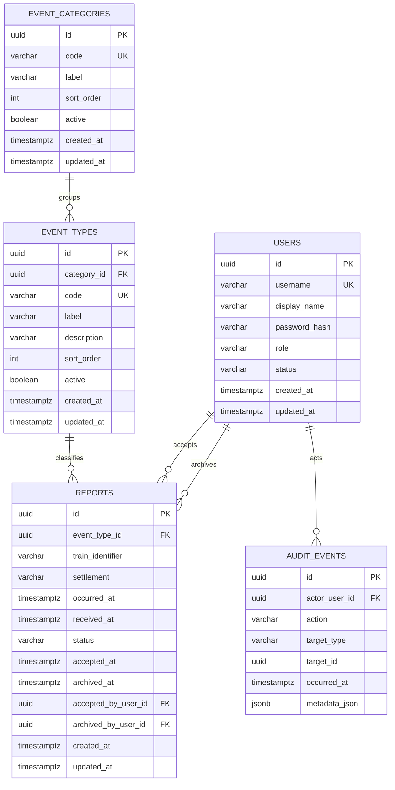

# Őrszem — Demo v1 adatbázisséma

**Dokumentum státusza:** implementációs adatmodell — v1.0  
**Célközönség:** backend fejlesztő és implementáló AI (Claude Code)  
**Kapcsolódó dokumentum:** `ARCHITECTURE.md` / Őrszem Demo v1 technikai architektúra  
**Adatbázis:** PostgreSQL

---

## 1. Cél és határ

Ez a dokumentum a Demo v1 **kanonikus perzisztencia-modelljét** rögzíti.

A séma kizárólag a Demo v1-ben szükséges adatokat tartalmazza:

- eseménytípus-katalógus;
- anonim lakossági bejelentések;
- minimális szolgálati felhasználó;
- esetkezelési állapotok;
- audit események.

A Production funkciók — területek, Fő Admin, Moderátor, hierarchia, jelszó-reset, refresh session, spam/troll moderáció, szabad szöveges jelentés — **nem kerülnek előre üres oszlopként vagy placeholder táblaként a Demo v1 sémába**. Ezeket későbbi Flyway migrációk adják hozzá.

---

## 2. Entitáskapcsolatok



---

## 3. `event_categories`

Az események magasabb szintű csoportjai. A Public App ezeket használhatja a hosszú legördülő eseménylista áttekinthető csoportosítására, az Analytics pedig kategória szerinti megoszlásra.

| Oszlop | PostgreSQL típus | Null | Szabály |
| --- | --- | --- | --- |
| `id` | `uuid` | nem | elsődleges kulcs |
| `code` | `varchar(64)` | nem | stabil, egyedi gépi kód |
| `label` | `varchar(120)` | nem | magyar megjelenítési név |
| `sort_order` | `integer` | nem | kategóriák sorrendje, `>= 0` |
| `active` | `boolean` | nem | megjeleníthető-e új választásnál |
| `created_at` | `timestamptz` | nem | létrehozás ideje |
| `updated_at` | `timestamptz` | nem | utolsó módosítás ideje |

A kategória `code` stabil domain-azonosító. Report statisztikában a kategória mindig az eseménytípus kapcsolatából vezetendő le.

### 3.1 Indexek

- egyedi: `code`;
- rendezés: `(active, sort_order, label)`.

---

## 4. `event_types`

Az eseménytípus-katalógus a lakossági alkalmazás legördülő listájának kanonikus szerveroldali forrása.

A Demo v1 jóváhagyott katalógusa 7 kategóriából és 61 aktív eseménytípusból áll; a teljes lista és stabil kódok a `docs/product/EVENT_CATALOG.md` fájlban találhatók. A demo/local adatbázis seed a `db/demo/R__demo_event_catalog.sql` repeatable migrációból tölthető.

| Oszlop | PostgreSQL típus | Null | Szabály |
| --- | --- | --- | --- |
| `id` | `uuid` | nem | elsődleges kulcs |
| `category_id` | `uuid` | nem | FK → `event_categories.id` |
| `code` | `varchar(64)` | nem | stabil, egyedi gépi kód |
| `label` | `varchar(120)` | nem | magyar megjelenítési név |
| `description` | `varchar(500)` | igen | rövid opcionális magyarázat |
| `sort_order` | `integer` | nem | UI-rendezési sorrend, `>= 0` |
| `active` | `boolean` | nem | új reporthoz választható-e |
| `created_at` | `timestamptz` | nem | létrehozás ideje |
| `updated_at` | `timestamptz` | nem | utolsó módosítás ideje |

### 4.1 Szabályok

- `code` nem változhat jelentésének megváltoztatásával; stabil domain-azonosító.
- A `label` később módosítható anélkül, hogy a régi reportok kapcsolata elveszne.
- Inaktív eseménytípus új reportban nem fogadható el.
- Már létező report továbbra is hivatkozhat időközben inaktivált eseménytípusra.
- Eseménytípust Demo v1-ben ne töröljünk hard delete-tel, ha report hivatkozik rá.

### 4.2 Indexek

- egyedi: `code`;
- rendezés/listázás: `(active, sort_order, label)`.

---

## 5. `users`

A Demo v1 minimális, kizárólag a Szolgálati App belépéséhez szükséges user-modellje.

| Oszlop | PostgreSQL típus | Null | Szabály |
| --- | --- | --- | --- |
| `id` | `uuid` | nem | elsődleges kulcs |
| `username` | `varchar(100)` | nem | egyedi login azonosító |
| `display_name` | `varchar(150)` | nem | UI-ban megjelenő név |
| `password_hash` | `varchar(255)` | nem | kizárólag password hash |
| `role` | `varchar(32)` | nem | Demo v1: `SERVICE_USER` |
| `status` | `varchar(32)` | nem | `ACTIVE` vagy `DISABLED` |
| `created_at` | `timestamptz` | nem | létrehozás ideje |
| `updated_at` | `timestamptz` | nem | utolsó módosítás ideje |

### 5.1 Demo v1 szabályok

- Legalább egy seedelt `SERVICE_USER` szükséges.
- Plaintext jelszó nem kerülhet adatbázisba.
- `DISABLED` user nem kaphat access tokent.
- Demo v1-ben nincs password reset, jelszócsere, moderátori szerep vagy területi hozzárendelés.

### 5.2 Production bővítés

Későbbi migrációk adhatják hozzá többek között:

- `SUPER_ADMIN` és `MODERATOR` szerepeket;
- `supervisor_user_id`;
- `must_change_password`;
- területi kapcsolatot;
- refresh/session táblákat.

---

## 6. `reports`

A report az anonim lakossági bejelentés kanonikus üzleti rekordja.

| Oszlop | PostgreSQL típus | Null | Szabály |
| --- | --- | --- | --- |
| `id` | `uuid` | nem | kliens által generált elsődleges kulcs |
| `event_type_id` | `uuid` | nem | FK → `event_types.id` |
| `train_identifier` | `varchar(64)` | nem | pl. `IC 123` |
| `settlement` | `varchar(128)` | nem | település neve |
| `occurred_at` | `timestamptz` | nem | esemény ideje |
| `received_at` | `timestamptz` | nem | backend fogadási ideje |
| `status` | `varchar(32)` | nem | `NEW`, `IN_PROGRESS`, `ARCHIVED` |
| `accepted_at` | `timestamptz` | igen | elfogadás ideje |
| `archived_at` | `timestamptz` | igen | archiválás ideje |
| `accepted_by_user_id` | `uuid` | igen | FK → `users.id` |
| `archived_by_user_id` | `uuid` | igen | FK → `users.id` |
| `created_at` | `timestamptz` | nem | technikai létrehozás |
| `updated_at` | `timestamptz` | nem | utolsó állapotmódosítás |

### 6.1 Nincs a Demo v1 reportban

A tábla szándékosan nem tartalmaz:

- bejelentői user ID-t;
- nevet, e-mailt, telefonszámot;
- szabad szöveges eseményleírást;
- fotót;
- nyers latitude/longitude adatot;
- `area_id`-t;
- AI kockázati besorolást.

### 6.2 Állapotgép

```text
NEW
 ↓ accept
IN_PROGRESS
 ↓ archive
ARCHIVED
```

Az adatbázis állapotkonzisztenciája:

#### `NEW`

- `accepted_at IS NULL`
- `accepted_by_user_id IS NULL`
- `archived_at IS NULL`
- `archived_by_user_id IS NULL`

#### `IN_PROGRESS`

- `accepted_at IS NOT NULL`
- `accepted_by_user_id IS NOT NULL`
- `archived_at IS NULL`
- `archived_by_user_id IS NULL`

#### `ARCHIVED`

- `accepted_at IS NOT NULL`
- `accepted_by_user_id IS NOT NULL`
- `archived_at IS NOT NULL`
- `archived_by_user_id IS NOT NULL`

A konkrét átmenetet továbbra is a backend domain/application rétege kényszeríti ki. A DB check constraint az inkonzisztens rekordállapot ellen második védelmi réteg.

### 6.3 Idempotencia

A `reports.id` a Public App által küldés előtt generált UUID.

`POST /api/v1/public/reports` esetén:

1. ha az ID még nem létezik, új rekord készül;
2. ha az ID létezik és a kliens által küldhető üzleti mezők megegyeznek, a kérés idempotens ismétlés;
3. ha az ID létezik, de az üzleti tartalom eltér, `409 REPORT_ID_CONFLICT` üzleti hiba keletkezik.

Az összehasonlítandó kliensmezők:

- `eventTypeCode` → feloldott `event_type_id`;
- `trainIdentifier`;
- `settlement`;
- `occurredAt`.

A státusz és a szerver által előállított mezők nem részei az idempotencia-inputnak.

### 6.4 Konkurens elfogadás

Az `accept` művelet atomikus feltételes módosításként implementálandó, például logikailag:

```sql
UPDATE reports
SET status = 'IN_PROGRESS',
    accepted_at = :now,
    accepted_by_user_id = :actorId,
    updated_at = :now
WHERE id = :reportId
  AND status = 'NEW';
```

Pontosan egy kérés nyerhet. `0` módosított sor esetén a backend különböztesse meg a `404 REPORT_NOT_FOUND` és `409 REPORT_NOT_ACCEPTABLE` esetet.

### 6.5 Indexek

- `(status, received_at DESC)` — aktív lista;
- `(event_type_id, occurred_at DESC)` — eseménytípus-statisztika;
- `(settlement, occurred_at DESC)` — település-statisztika;
- `(train_identifier, occurred_at DESC)` — vonat-statisztika;
- `(archived_at DESC) WHERE status = 'ARCHIVED'` — archívum.

---

## 7. `audit_events`

Az audit üzleti/biztonsági eseménynapló. Nem helyettesíti az operatív alkalmazáslogot.

| Oszlop | PostgreSQL típus | Null | Szabály |
| --- | --- | --- | --- |
| `id` | `uuid` | nem | elsődleges kulcs |
| `actor_user_id` | `uuid` | igen | FK → `users.id`; anonim/system eseménynél lehet null |
| `action` | `varchar(64)` | nem | stabil műveletkód |
| `target_type` | `varchar(64)` | nem | pl. `REPORT`, `AUTH` |
| `target_id` | `uuid` | igen | érintett üzleti rekord |
| `occurred_at` | `timestamptz` | nem | esemény időpontja |
| `metadata_json` | `jsonb` | nem | minimális, nem érzékeny metadata |

### 7.1 Demo v1 javasolt audit action kódok

- `SERVICE_LOGIN_SUCCESS`
- `SERVICE_LOGIN_FAILURE`
- `REPORT_ACCEPTED`
- `REPORT_ARCHIVED`

A login failure auditba jelszó, token vagy Authorization header nem kerülhet.

### 7.2 Index

- `(target_type, target_id, occurred_at DESC)`;
- opcionális: `(actor_user_id, occurred_at DESC)`.

---

## 8. Törlési szabályok

Demo v1-ben:

- reportot a felhasználói API nem töröl;
- service usert normál működés során ne hard-delete-eljünk, hanem státusszal kezeljünk;
- event type-ot report-hivatkozás mellett ne hard-delete-eljünk;
- audit esemény append-only szemléletű.

A demo reset kivételes, környezet-specifikus művelet, amely kizárólag `local` / `demo` profilban törölheti és újraseedelheti a demo adatokat.

---

## 9. Időkezelés

- PostgreSQL: minden üzleti idő `timestamptz`.
- Backend domain: UTC `Instant`.
- API: ISO 8601 UTC, például `2026-09-01T18:42:00Z`.
- UI: a készülék lokális időzónájára formáz.
- A DB session timezone konfigurációja legyen UTC.
- Naptári naphoz kötött analytics (pl. „mai bejelentések”) a backend konfigurált üzleti időzónáját használja; Demo v1 alapértelmezés: `Europe/Budapest`.

---

## 10. Tranzakciós határok

Külön tranzakció legyen legalább:

1. public report létrehozása/idempotens ellenőrzése;
2. report elfogadása + audit esemény;
3. report archiválása + audit esemény.

Analytics csak olvasási műveleteket végez.

---

## 11. Analytics lekérdezési alapok

A Demo v1 statisztika a `reports` + `event_types` kanonikus adataiból számolható; külön materialized view vagy analytics tábla nem szükséges.

Kötelező aggregációk:

- összes report;
- mai report;
- aktív report (`NEW` + `IN_PROGRESS`);
- archivált report;
- eseménytípus szerinti darabszám;
- eseménykategória (`event_categories`) szerinti darabszám;
- település szerinti darabszám;
- vonat szerinti darabszám.

A Demo v1-ben az aggregációk kéréskor számolhatók. Előaggregáció csak mérési eredmény alapján vezethető be később.

---

## 12. Flyway szabályok

- A séma kizárólag új Flyway migrációval változhat.
- Már alkalmazott migrációt Claude nem írhat át.
- Demo-only seed adat ne keveredjen production schema migrációba.
- A `V1__init_demo_schema.sql` kizárólag sémát hoz létre.
- Eseménykatalógus és reprezentatív demo reportok külön demo seed mechanizmusból kerüljenek be.

---

## 13. Production migrációs irány

A Demo v1 séma később az alábbi irányban bővíthető újraírás nélkül:

```text
users
 ├── role bővítés: SUPER_ADMIN / MODERATOR / SERVICE_USER
 ├── supervisor_user_id
 └── must_change_password

areas
 ├── id
 ├── code
 └── name

settlement_area_mapping
 ├── settlement
 └── area_id

service_user_areas vagy users.area_id

reports
 ├── area_id
 ├── free_text
 ├── moderation_status
 └── későbbi AI analysis referencia
```

A Production területi hozzáférést a backend vezeti le; kliens által küldött `areaId` nem válhat hiteles jogosultsági forrássá.

---

## 14. Definition of Done — adatbázis

A Demo v1 adatbázisréteg akkor kész, ha:

- a `V1__init_demo_schema.sql` üres PostgreSQLen hibamentesen lefut;
- minden FK és check constraint működik;
- inkonzisztens report-állapot nem menthető;
- ugyanazon report UUID nem duplikálható;
- aktív lista és statisztikai lekérdezések indexeltek;
- schema migráció Testcontainers tesztben is lefut;
- demo seed nem indul production profilban;
- plaintext jelszó nem kerül adatbázisba.
